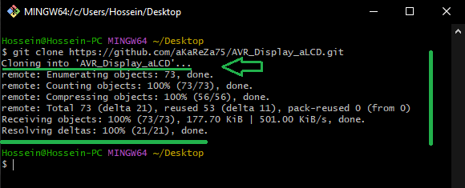

# Alphanumeric Display (4-bit Mode) with AVR

The alphanumeric display is a character-based LCD that can display up to 16 characters per row and 2 rows (for example 16x2).   

The display can operate in two modes
- **8-bit mode** (all 8 data pins used)
- **4-bit mode** (only 4 data pins used)

In 4-bit mode, only 4 data lines are used to transmit data, saving on pin usage compared to the 8-bit mode.    
This document provides a comprehensive guide to using an alphanumeric LCD with the AVR microcontrollers in 4-bit parallel mode. The provided `alcd.h` library simplifies LCD control.  

The display uses the following pins:
- RS (Register Select) for selecting data/command mode
- EN (Enable) for latching data into the display
- DB4 to DB7 for data transmission
- BL (Backlight) control (optional)

<table>
  <tr>
  <td valign="top">
  
  > [!TIP]  
  > If you're looking to better understand how to navigate and use my GitHub repositories — including exploring their structure, downloading or cloning projects, submitting issues, and asking questions,  
  > everything you need is clearly explained in this video:  
  > [aKaReZa 95 - Programming, Git - PART B](https://youtu.be/zYiUItVFRqQ)  
  > Make sure to check it out!
  
  </td>
    <td width="360" valign="middle" style="padding: 0;">
      <a href="https://youtu.be/zYiUItVFRqQ">
       
      </a>
    </td>

  </td>
  </tr>
  <tr>
  <td colspan="2">

  > [!CAUTION]
  > It is absolutely critical that you carefully read every single word of this document, line by line, to ensure you don't miss any details. Nothing can be overlooked.
      
  </td>
  </tr>  
</table>

## Hardware Pin & Register Definitions
In this library, it is very easy to connect the LCD pins to any desired microcontroller pins. The default pin assignments provided in the library are configured to work with the D1 LCD Shield.   

Pin Assignments by Defaults:
```c
RS -> PORTB.0
EN -> PORTB.1
DB4 -> PORTB.4
DB5 -> PORTB.5
DB6 -> PORTB.6
DB7 -> PORTB.7
BL -> PORTB.2 (Optional)
```

However, if you wish to use different pins for your specific hardware, you can simply modify the corresponding pin definitions in the **alcd.h** file.

You can change the pin assignments to any other GPIO pins by simply modifying the values of `__alcd_RS_Pin`, `__alcd_EN_Pin`, `__alcd_DB4_Pin`, `__alcd_DB5_Pin`, `__alcd_DB6_Pin`, and `__alcd_DB7_Pin` to match your hardware configuration.  


```c
/* Control Pins */
#define __alcd_RS_Config   DDRB  /**< RS pin direction register */
#define __alcd_RS_Control  PORTB /**< RS pin port register */
#define __alcd_RS_Pin      0     /**< RS pin number */

#define __alcd_EN_Config   DDRB  /**< EN pin direction register */
#define __alcd_EN_Control  PORTB /**< EN pin port register */
#define __alcd_EN_Pin      1     /**< EN pin number */

/* Data Pins */
#define __alcd_DB4_Config  DDRD  /**< DB4 direction register */
#define __alcd_DB4_Control PORTD /**< DB4 port register */
#define __alcd_DB4_Pin     4     /**< DB4 pin number */

#define __alcd_DB5_Config  DDRD  /**< DB5 direction register */
#define __alcd_DB5_Control PORTD /**< DB5 port register */
#define __alcd_DB5_Pin     5     /**< DB5 pin number */

#define __alcd_DB6_Config  DDRD  /**< DB6 direction register */
#define __alcd_DB6_Control PORTD /**< DB6 port register */
#define __alcd_DB6_Pin     6     /**< DB6 pin number */

#define __alcd_DB7_Config  DDRD  /**< DB7 direction register */
#define __alcd_DB7_Control PORTD /**< DB7 port register */
#define __alcd_DB7_Pin     7     /**< DB7 pin number */

/* Backlight */
#ifdef __alcd_useBL
    #define __alcd_BL_Config   DDRB  /**< Backlight direction register */
    #define __alcd_BL_Control  PORTB /**< Backlight port register */
    #define __alcd_BL_Pin      2     /**< Backlight pin number */
#endif
```

> [!NOTE]  
> Using the backlight is optional. If you want to utilize this feature, you must first set the macro `#define __alcd_useBL true`. Once this is set to `true`, the block for the backlight will be enabled, allowing you to define the desired pin for the backlight control.

## API Reference
To use the LCD driver, include the `alcd.h` header file in your project.  Then, use the following functions to control the LCD.

> [!NOTE]  
> The library and all of its APIs provided below have been developed by myself.  
This library utilizes various macros defined in the `aKaReZa.h` header file, which are designed to simplify bitwise operations and register manipulations.    
Detailed descriptions of these macros can be found at the following link:  
> [https://github.com/aKaReZa75/AVR/blob/main/Macros.md](https://github.com/aKaReZa75/AVR/blob/main/Macros.md)  

### Initialization
```c
void alcd_init(void);
```
 * Initializes the LCD module.
 * This function must be called before any other LCD function.
 * It configures the necessary pins and sends initialization commands to the LCD.

> [!IMPORTANT]  
Currently, this library supports only the 16x2 LCD display. If you are using a display with a different size, you may need to modify the library to support it.

Example:
```c
#include "aKaReZa.h"
#include "alcd.h"

int main(void) 
{
    alcd_init(); /**< Initialize the LCD */
    while(1)
    {
        /* ... your code ... */        
    }
}
```

### Display Control
```c
void alcd_clear(void);
```
 * Clear the display and return the cursor to the home position (0, 0).

```c
void alcd_display(_Bool _alcd_displayStatus);
```
 * Turn the display on or off.
 * @param `_alcd_displayStatus` TRUE to turn on, FALSE to turn off.
 
> [!NOTE]  
By default, the display is turned on. Therefore, there is no need to explicitly issue a command to enable the LCD display.

Example:
```c

#include "aKaReZa.h"
#include "alcd.h"

int main(void) 
{
    alcd_init();
    alcd_display(true); /**< Turn on the display */
    alcd_clear(); /**< Clear the display */
    while(1)
    {
        /* ... your code ... */
    }
}
```

    
### Cursor Control
```c
void alcd_cursor(_Bool _alcd_Cursor, _Bool _alcd_Blink);
```
 * Control the cursor appearance.
 * @param `_alcd_Cursor` TRUE to show the cursor, FALSE to hide it.
 * @param `_alcd_Blink` TRUE to enable blinking, FALSE to disable it.


```c
void alcd_gotoxy(uint8_t _alcd_x_position, uint8_t _alcd_y_position);
```
 * Set the cursor position.
 * @param `_alcd_x_position` Column position (0-15).
 * @param `_alcd_y_position` Row position (0-1).
 
> [!NOTE]
By default, the cursor is off and does not blink. If you want to enable the cursor or blinking, you can use the `alcd_cursor()` function to configure the desired behavior.

Example:
```c
#include "aKaReZa.h"
#include "alcd.h"

int main(void) 
{
    alcd_init();
    alcd_cursor(true, false); /**< Show the cursor without blinking */
    alcd_gotoxy(5, 1); // Move cursor to column 5, row 1
    while(1)
    {
        /* ... your code ... */
    }
}

```

### Data Writing
```c
void alcd_write(uint8_t _alcd_write_value, bool _alcd_cmdData);
```
 * Sends a command or data byte to the LCD (low-level function).
 * @param `_alcd_write_value` The byte value (command or data) to send to the LCD.
 * @param `_alcd_cmdData` A boolean indicating whether the byte is a command (`false`) or data (`true`).
 * Use the pre-defined constants `__alcd_writeData` and `__alcd_writeCmd` for clarity.
 
Example:
```c
#include "aKaReZa.h"
#include "alcd.h"

int main(void) 
{
    alcd_init();
    alcd_write(0x41, __alcd_writeData); // Write 'A' (ASCII 0x41) to the LCD
    alcd_write(__alcd_DISPLAY_CLEAR, __alcd_writeCmd); // Clear the display using a command
    while(1)
    {
        /* ... your code ... */
    }
}
```
 
```c
void alcd_putc(char c);
```
 * Display single character at current cursor position.
 * @param c The character to display on the LCD.
 
```c
void alcd_puts(char *_alcd_str);
```
 * Write a string to the display.
 * @param `_alcd_str` Null-terminated string to display.
 
Example:
```c
#include "aKaReZa.h"
#include "alcd.h"

int main(void) 
{
    alcd_init();
    alcd_gotoxy(0, 0); /**< Move cursor to the first row, first column */
    alcd_putc('X'); /**< Print 'X' to the LCD */
    alcd_gotoxy(0, 1); /**< Move cursor to the first row, second column */    
    alcd_puts("Hello, World!"); /**< Print "Hello, World!" to the LCD */
    while(1)
    {
        /* ... your code ... */
    }
}
```

### Backlight Control

> [!IMPORTANT]
If the **__alcd_useBL** macro is true, the backlight can be controlled.   
In this case, the backlight pin (often pin 16 on the display, also known as LED-) should be driven through a NPN transistor to ensure proper current handling.    

```c
void alcd_backLight(bool _alcd_backLightStatus);
```
 * Control the backlight (if enabled).
 * @param `_alcd_backLightStatus` Set to true to turn the backlight on, false to turn it off.
 
Example:
```c
#include "aKaReZa.h"
#include "alcd.h"

int main(void) 
{
    alcd_init();
    while(1)
    {
        alcd_backLight(true); /**< Turn the backlight on */
        delay_ms(500);
        alcd_backLight(false); /**< Turn the backlight off */
        delay_ms(500);        
    }
}
```

### Custom Characters
```c
 void alcd_customChar(uint8_t _alcd_CGRAMadd, const uint8_t *_alcd_CGRAMdata);
```
 * Defines a custom character and stores it in the LCD's CGRAM.
 * `_alcd_CGRAMadd`: The CGRAM address (0-7) where the character will be stored.
 * `_alcd_CGRAMdata`: A pointer to an array of 8 bytes representing the character data. Each byte represents a row of the character.
 
> [!TIP]  
> To easily and quickly create custom characters for your LCD display, you can use the following online tools:
> - [LCD Character Creator](https://maxpromer.github.io/LCD-Character-Creator/)
> - [HD44780 Custom Character Generator](https://www.quinapalus.com/hd44780udg.html)   
>
> These tools allow you to design custom characters visually and generate the corresponding byte data that can be used with the `alcd_customChar` function.

Example:
```c
#include "aKaReZa.h"
#include "alcd.h"

uint8_t heart[8] = 
{
    0b00000,
    0b01010,
    0b11111,
    0b11111,
    0b01110,
    0b00100,
    0b00000,
    0b00000
};

uint8_t smiley[8] = 
{
    0b00000,
    0b01010,
    0b01010,
    0b00000,
    0b10001,
    0b01110,
    0b00000,
    0b00000
};

int main(void) 
{
    alcd_init();
    alcd_customChar(0, heart); /**< Store the heart character at CGRAM address 0 */
    alcd_customChar(1, smiley); /**< Store the smiley character at CGRAM address 1 */    
    alcd_putc(0); /**<  Print the heart character (ASCII code 0 for CGRAM address 0) */
    alcd_gotoxy(0, 1); /**< Move cursor to the first row, second column */  
    alcd_putc(1); /**<  Print the smiley character (ASCII code 1 for CGRAM address 1) */    
    while(1)
    {
        /* ... your code ... */
    }
}
```

### **Summary**

| **Function** | **Purpose** |
|-------------|------------|
| `alcd_init()` | Initializes the LCD |
| `alcd_clear()` | Clears the LCD screen |
| `alcd_gotoxy(x, y)` | Moves cursor to (x, y) position |
| `alcd_puts("text")` | Displays a string on the LCD |
| `alcd_putc('c')` | Displays a single character |
| `alcd_cursor(true, false)` | Enables cursor without blinking |
| `alcd_display(true)` | Turns the LCD display ON |
| `alcd_customChar(pos, data)` | Stores a custom character |
| `alcd_backLight(true)` | Turns backlight ON |

## Complete Example
```c
#include "aKaReZa.h"
#include "alcd.h"

/* Main function demonstrating LCD usage */
int main(void) 
{
    alcd_init(); /**< Initialize LCD */

    alcd_clear(); /**< Clear the display */

    alcd_backLight(true); /**< Turn on the backlight (if available) */

    alcd_gotoxy(0, 0); /* Set cursor position to column 0, row 0 */

    alcd_puts("Hello, World!"); /**< Write text to the LCD */

    while (1) 
    {
        /* ... your code ... */
    }
}
```
## Important Notes
- Always call alcd_init() before using any other LCD functions.
- Verify that the pin definitions in alcd.h match your actual hardware connections.
-  Most LCD modules have a potentiometer for adjusting the contrast.  Adjust this potentiometer to achieve optimal visibility.
- Custom characters are stored in CGRAM, which has a **limit of 8 characters**, remember that CGRAM addresses are 0-7. The ASCII codes corresponding to these addresses are also 0-7.
- The aKaReZa.h library is essential to provide `delay_ms()` and bit manipulation macros (bitSet, bitClear, etc.).  Ensure that it is correctly included in your project and that the `delay_ms()` function is properly implemented for your clock frequency.  Without a correct delay function, the LCD will not initialize or operate correctly.
- The first row index is `0`, and the second row index is `1`, not `1` and `2`.

### Performance Considerations
1. Each command requires minimum 37μs execution time
2. Clear display command requires 1.52ms
3. CGRAM writes should be done during initialization
4. Backlight control may affect power consumption significantly

# 🔗 Resources
  Here you'll find a collection of useful links and videos related to the topic of AVR microcontrollers.  

<table style="border-collapse: collapse;">
  <tr>
    <td valign="top" style="padding: 0 10px;">
      <h3 style="margin: 0;">
        <a href="https://youtu.be/hNRjyU02NoM">aKaReZa 57 – AVR, Alphanumeric LCD</a>
      </h3>
      <p style="margin: 8px 0 0;">
        Learn how to set up an alphanumeric LCD with AVR microcontrollers, use library functions, display decimal numbers, create custom and Persian characters, and adjust the display contrast.
      </p>
    </td>
    <td width="360" valign="top" style="padding: 0;">
      <a href="https://youtu.be/hNRjyU02NoM">
        
      </a>
    </td>
  </tr>
</table>
  
> [!TIP]
> The resources are detailed in the sections below.  
> To access any of them, simply click on the corresponding blue link.

- [AVR Microntroller](https://github.com/aKaReZa75/AVR)
  ---  
    This repository contains comprehensive resources for AVR microcontrollers, including hardware schematics, software libraries, and educational projects.

# 💻 How to Use Git and GitHub
To access the repository files and save them on your computer, there are two methods available:
1. **Using Git Bash and Cloning the Repository**
   - This method is more suitable for advanced users and those familiar with command-line tools.
   - By using this method, you can easily receive updates for the repository.

2. **Downloading the Repository as a ZIP file**
   - This method is simpler and suitable for users who are not comfortable with command-line tools.
   - Note that with this method, you will not automatically receive updates for the repository and will need to manually download any new updates.

## Clone using the URL.
First, open **Git Bash** :
-  Open the folder in **File Explorer** where you want the library to be stored.
-  **Right-click** inside the folder and select the option **"Open Git Bash here"** to open **Git Bash** in that directory.


> [!NOTE] 
> If you do not see the "Open Git Bash here" option, it means that Git is not installed on your system.  
> You can download and install Git from [this link](https://git-scm.com/downloads).  
> For a tutorial on how to install and use Git, check out [this video](https://youtu.be/BsykgHpmUt8).
  
-  Once **Git Bash** is open, run the following command to clone the repository:

 ```bash
git clone https://github.com/aKaReZa75/AVR_Display_aLCD.git
```
- You can copy the above command by either:
- Clicking on the **Copy** button on the right of the command.
- Or select the command text manually and press **Ctrl + C** to copy.
- To paste the command into your **Git Bash** terminal, use **Shift + Insert**.


- Then, press Enter to start the cloning operation and wait for the success message to appear.



> [!IMPORTANT]
> Please keep in mind that the numbers displayed in the image might vary when you perform the same actions.  
> This is because repositories are continuously being updated and expanded. Nevertheless, the overall process remains unchanged.

> [!NOTE]
> Advantage of Cloning the Repository:  
> - **Receiving Updates:** By cloning the repository, you can easily and automatically receive new updates.  
> - **Version Control:** Using Git allows you to track changes and revert to previous versions.  
> - **Team Collaboration:** If you are working on a project with a team, you can easily sync changes from team members and collaborate more efficiently.  

## Download Zip
If you prefer not to use Git Bash or the command line, you can download the repository directly from GitHub as a ZIP file.  
Follow these steps:  
1. Navigate to the GitHub repository page and Locate the Code button:
   - On the main page of the repository, you will see a green Code button near the top right corner.

2. Download the repository:
   - Click the Code button to open a dropdown menu.
   - Select Download ZIP from the menu.

    

3. Save the ZIP file:
   - Choose a location on your computer to save the ZIP file and click Save.

4. Extract the ZIP file:
   - Navigate to the folder where you saved the ZIP file.
   - Right-click on the ZIP file and select Extract All... (Windows) or use your preferred extraction tool.
   - Choose a destination folder and extract the contents.

5. Access the repository:
   - Once extracted, you can access the repository files in the destination folder.

> [!IMPORTANT]
> - No Updates: Keep in mind that downloading the repository as a ZIP file does not allow you to receive updates.    
>   If the repository is updated, you will need to download it again manually.  
> - Ease of Use: This method is simpler and suitable for users who are not comfortable with Git or command-line tools.

# 📝 How to Ask Questions
If you have any questions or issues, you can raise them through the **"Issues"** section of this repository. Here's how you can do it:  

1. Navigate to the **"Issues"** tab at the top of the repository page.  

  

2. Click on the **"New Issue"** button.  
   
  

3. In the **Title** field, write a short summary of your issue or question.  

4. In the "Description" field, detail your question or issue as thoroughly as possible. You can use text formatting, attach files, and assign the issue to someone if needed. You can also use text formatting (like bullet points or code snippets) for better readability.  

5. Optionally, you can add **labels**, **type**, **projects**, or **milestones** to your issue for better categorization.  

6. Click on the **"Submit new issue"** button to post your question or issue.
   
  

I will review and respond to your issue as soon as possible. Your participation helps improve the repository for everyone!  

> [!TIP]
> - Before creating a new issue, please check the **"Closed"** section to see if your question has already been answered.  
>     
> - Write your question clearly and respectfully to ensure a faster and better response.  
> - While the examples provided above are in English, feel free to ask your questions in **Persian (فارسی)** as well.  
> - There is no difference in how they will be handled!  

> [!NOTE]
> Pages and interfaces may change over time, but the steps to create an issue generally remain the same.

# 🤝 Contributing to the Repository
To contribute to this repository, please follow these steps:
1. **Fork the Repository**  
2. **Clone the Forked Repository**  
3. **Create a New Branch**  
4. **Make Your Changes**  
5. **Commit Your Changes**  
6. **Push Your Changes to Your Forked Repository**  
7. **Submit a Pull Request (PR)**  

> [!NOTE]
> Please ensure your pull request includes a clear description of the changes you’ve made.
> Once submitted, I will review your contribution and provide feedback if necessary.

# 🌟 Support Me
If you found this repository useful:
- Subscribe to my [YouTube Channel](https://www.youtube.com/@aKaReZa75).
- Share this repository with others.
- Give this repository and my other repositories a star.
- Follow my [GitHub account](https://github.com/aKaReZa75).

# 📜 License
This project is licensed under the GPL-3.0 License. This license grants you the freedom to use, modify, and distribute the project as long as you:
- Credit the original authors: Give proper attribution to the original creators.
- Disclose source code: If you distribute a modified version, you must make the source code available under the same GPL license.
- Maintain the same license: When you distribute derivative works, they must be licensed under the GPL-3.0 too.
- Feel free to use it in your projects, but make sure to comply with the terms of this license.
  
# ✉️ Contact Me
Feel free to reach out to me through any of the following platforms:
- 📧 [Email: aKaReZa75@gmail.com](mailto:aKaReZa75@gmail.com)
- 🎥 [YouTube: @aKaReZa75](https://www.youtube.com/@aKaReZa75)
- 💼 [LinkedIn: @akareza75](https://www.linkedin.com/in/akareza75)
